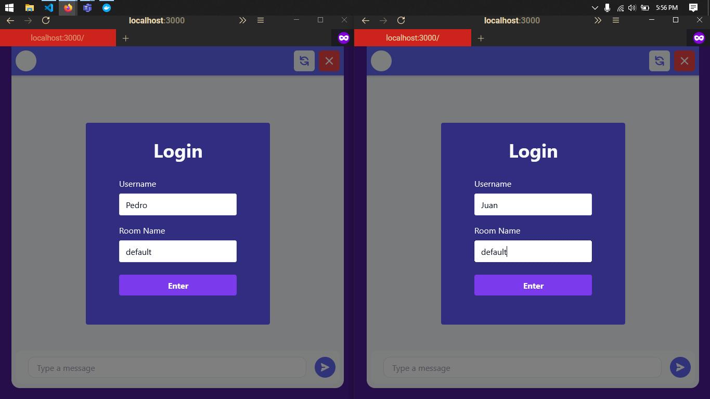
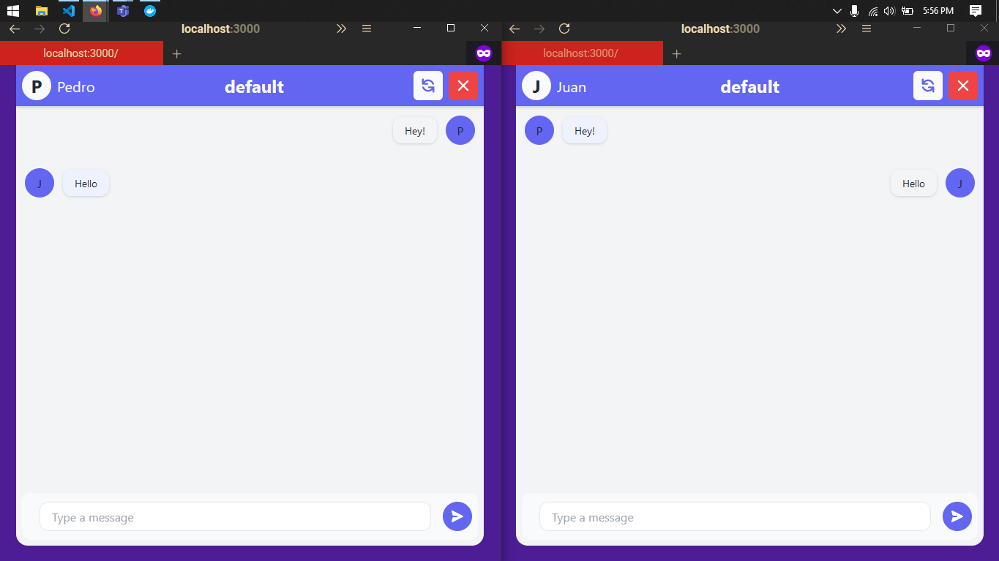

## Description

A message queue app using nextjs, amqp and tailwindcss.

## How To Run

### 1. run docker

docker run -it --rm --name rabbitmq -p 5672:5672 -p 15672:15672 rabbitmq:3-management

### 2. run app

npm run dev

## Views

### Login

### Chat

